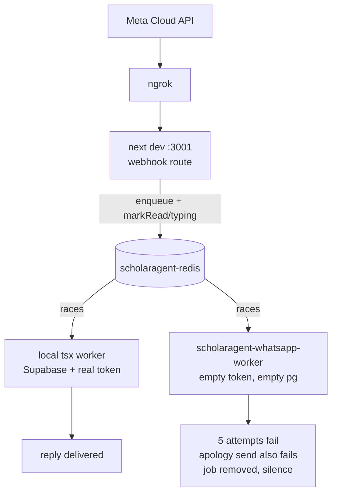

## Root cause

`docker compose up -d` left `scholaragent-whatsapp-worker` running (up 15 hours). It consumes the **same** `whatsapp-incoming` BullMQ queue in the **same** Redis container as your local `npx tsx scripts/whatsapp-worker.ts`, but is configured to fail:

- [docker-compose.yml](docker-compose.yml) line 83: `WHATSAPP_ACCESS_TOKEN: ${WHATSAPP_ACCESS_TOKEN:-}`. There is no `.env` in the repo (only `.env.example`), so this resolves to empty and every send throws `WHATSAPP_ACCESS_TOKEN is not configured`.
- Line 77: `DATABASE_URL` points at the local `scholaragent-pg` container, whose `users` table is empty. Its logs show `user_registry_phone_not_found` for `972***92`, while the local worker (Supabase) logs `permissionLevel: 0, roleName: Admin`.

Both workers reach Redis: the container via `redis://redis:6379`, your local process via `REDIS_URL=redis://127.0.0.1:6379` — the same `scholaragent-redis` container, published on 6379.

Whichever worker wins the BullMQ race decides the outcome. Correlating the dev-server, local-worker, and container logs for the six chat jobs enqueued at 05:50–05:52:

- `05:50:03` — container took attempt 1 and failed; local worker won attempt 2 → reply delivered
- `05:50:29` — container took all 5 attempts → silence
- `05:51:11` — container took all 5 attempts → silence
- `05:51:42` — local worker won attempt 1 → history menu delivered (`answerLen: 77`)
- `05:51:57` — **your "1" reply**; container took all 5 attempts (`:57, :59, 52:03, :11, :27`) → silence
- `05:52:44` — container took all 5 attempts → silence

The typing indicator still fires because it is sent from the webhook route, not the worker — `void markMessageReadAndTyping(messageId)` in [app/api/whatsapp/webhook/route.ts](app/api/whatsapp/webhook/route.ts) line 219. That is why you get ngrok 200, clean parse logs, typing, then nothing.

The state machine is fine. Redis still holds `admin:l0session:972543133292` = `{"mode":"awaiting_menu_choice"}` with ~44 minutes TTL left, correctly waiting for the "1" that was consumed by the wrong process.



## Fix 1 — one consumer, enforced by compose (primary)

In [docker-compose.yml](docker-compose.yml), put `app` and `whatsapp-worker` behind a profile so a bare `docker compose up -d` brings up infra only:

```yaml
  app:
    profiles: ["full"]
    build:
```

```yaml
  whatsapp-worker:
    profiles: ["full"]
    build:
```

Also make the missing token fail loudly instead of starting a worker that cannot send, for whenever the `full` profile is used:

```yaml
      WHATSAPP_ACCESS_TOKEN: ${WHATSAPP_ACCESS_TOKEN:?set WHATSAPP_ACCESS_TOKEN before running the full profile}
```

Then, as one-off commands: `docker compose down` followed by `docker compose up -d` (now redis + postgres only), and clear the stale menu session with `redis-cli DEL admin:l0session:972543133292`.

Note: with the `app` container stopped, port 3000 frees up and `npm run dev` will bind 3000 instead of 3001 — the ngrok tunnel target must be repointed.

## Fix 2 — make a duplicate consumer visible

Export a queue accessor from [lib/queue/whatsappIncomingQueue.ts](lib/queue/whatsappIncomingQueue.ts) (`export function getWhatsAppIncomingQueue()`, wrapping the existing private `getIncomingQueue`), then in [scripts/whatsapp-worker.ts](scripts/whatsapp-worker.ts), after the workers start, use BullMQ's built-in `CLIENT LIST` view and warn rather than block:

```ts
const peers = await getWhatsAppIncomingQueue().getWorkers();
if (peers.length > 1) {
  logWarn(
    "whatsapp_worker_duplicate_consumer",
    "More than one process is consuming whatsapp-incoming; jobs will be split between them.",
    { consumerCount: peers.length, addresses: peers.map((p) => p.addr) }
  );
}
```

Add `pid: process.pid` to the `whatsapp_queue_job_completed` and `whatsapp_queue_job_failed` meta in [lib/queue/workers/whatsappIncomingWorker.ts](lib/queue/workers/whatsappIncomingWorker.ts) so split traffic is greppable.

## Fix 3 (A) — the session trap

Both new menus hold the admin's entire message flow hostage with no escape but the exact word `ביטול`, for the full 1-hour TTL.

- [lib/agent/baseline/orchestrator.ts](lib/agent/baseline/orchestrator.ts) line 113: `userManagementActive` alone sets `userManagementRequested`, which preempts analytics, chat history, and RAG. An unparseable add-user line returns `ADD_FORMAT_RETRY` from `handleAddUserInput` without clearing the session, so every later message is swallowed.
- [lib/agent/baseline/chatHistoryHandlers.ts](lib/agent/baseline/chatHistoryHandlers.ts) line 190: while `awaiting_menu_choice` is set, any free-text question returns `בחירה לא מזוהה` instead of a RAG answer — the exact state your Redis is in right now.

Changes:

1. In [lib/chat/adminSession.ts](lib/chat/adminSession.ts), add `invalidAttempts: number` to `AdminSession` (parsed with a `0` default in `getAdminSession`), give `setAdminSession` an optional `invalidAttempts` argument, export `MAX_INVALID_ATTEMPTS = 3` and a `recordInvalidAttempt(adminPhone, session): Promise<number>` helper, and shorten the TTL for user-management modes:

```ts
const TTL_SECONDS = 60 * 60;
// User-management modes preempt every other intent, so they expire fast.
const USER_MANAGEMENT_TTL_SECONDS = 10 * 60;
```

2. In [lib/agent/baseline/userManagementHandlers.ts](lib/agent/baseline/userManagementHandlers.ts), have `handleAddUserInput` / `handleDeleteUserInput` return `{ ok: boolean; answer: string }` so the caller can distinguish a parse retry from a terminal outcome. Clear the session on every terminal outcome (`USER_EXISTS_MESSAGE`, `HIERARCHY_DENIED_MESSAGE`, `SELF_DELETE_DENIED_MESSAGE`, `USER_NOT_FOUND_MESSAGE`), and route the three retry branches — add-format, delete-format, and the `!menuChoice` case at line 390 — through a shared helper that bumps the counter and auto-exits:

```ts
async function failInvalid(
  adminPhone: string,
  session: AdminSession,
  retryMessage: string
): Promise<UserManagementFlowResult> {
  if ((await recordInvalidAttempt(adminPhone, session)) >= MAX_INVALID_ATTEMPTS) {
    await clearAdminSession(adminPhone);
    return { type: "text", answer: SESSION_ABANDONED_MESSAGE };
  }
  return { type: "text", answer: retryMessage };
}
```

3. Apply the same bounded-retry treatment to the `awaiting_menu_choice` branch in `resolveL0AdminFlow`.

4. `handleUserManagementButton` returns `{ type: "text", answer: "" }` for an unrecognised button (line 298), which reaches the processor's `baseline_empty_answer` path and shows the generic failure text. Return a real message instead.

## Fix 4 (B) — remove the debug instrumentation

[lib/debugAgentLog.ts](lib/debugAgentLog.ts) does a blocking `appendFileSync` and a floating `fetch` to `http://127.0.0.1:7467` on every message, and inline copies of the same `fetch` are pasted into the hot path. Delete `lib/debugAgentLog.ts`, remove every `// #region agent log` block and its import from [lib/agent/baseline/orchestrator.ts](lib/agent/baseline/orchestrator.ts), [lib/agent/baseline/userManagementHandlers.ts](lib/agent/baseline/userManagementHandlers.ts), and [lib/whatsapp/incomingMessageProcessor.ts](lib/whatsapp/incomingMessageProcessor.ts), and delete the `debug-771a5f.log` files at the repo root and in `.cursor/`.

While in [lib/whatsapp/messaging.ts](lib/whatsapp/messaging.ts), drop the two `console.log` payload dumps at lines 150 and 165 — they print the full outbound body outside the structured logger.

## Fix 5 (C) — propagate the job deadline into the menu handlers

`runBaselineRagCore` receives `signal`, but the chat-history summarisers do not, so their LLM calls ignore the 90s job deadline and worker shutdown. `GenerateTextInput` already accepts `signal` ([lib/llm/types.ts](lib/llm/types.ts) line 19). Thread the existing `BaselineProcessInput.signal` through:

`processBaselineQuery` → `resolveL0AdminFlow` / `runL1DailyStaffSummary` (both call sites, orchestrator lines 207 and 230) → `summarizeStaffDay` → `adapter.generateText({ ..., signal })`, and likewise into `resolveAdminAnalyticsFollowUp` at line 190.

## Verification

1. `docker compose ps` shows only `scholaragent-redis` and `scholaragent-pg`.
2. Worker startup logs no `whatsapp_worker_duplicate_consumer` warning.
3. `npm run dev` binds port 3000; repoint ngrok.
4. Send `היסטוריית שיחות` → menu appears → reply `1` → daily summary arrives. Confirm a single `whatsapp_queue_job_completed` at `attempt: 1`.
5. Open the user-management menu, send three unparseable lines, confirm the auto-exit message and that the next ordinary question gets a normal RAG answer.
6. `npx jest lib/agent/baseline/userManagementHandlers.test.ts` still passes; extend it with the bounded-retry case.

## Note on credentials

`.env.local` is untracked but holds live Gemini, Anthropic, Supabase, and Meta credentials, and it is inside a OneDrive-synced folder. The Meta access token and app secret are now in log output too. Worth rotating separately from this fix.