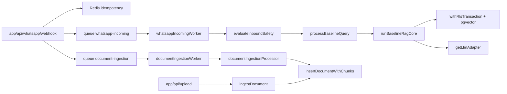
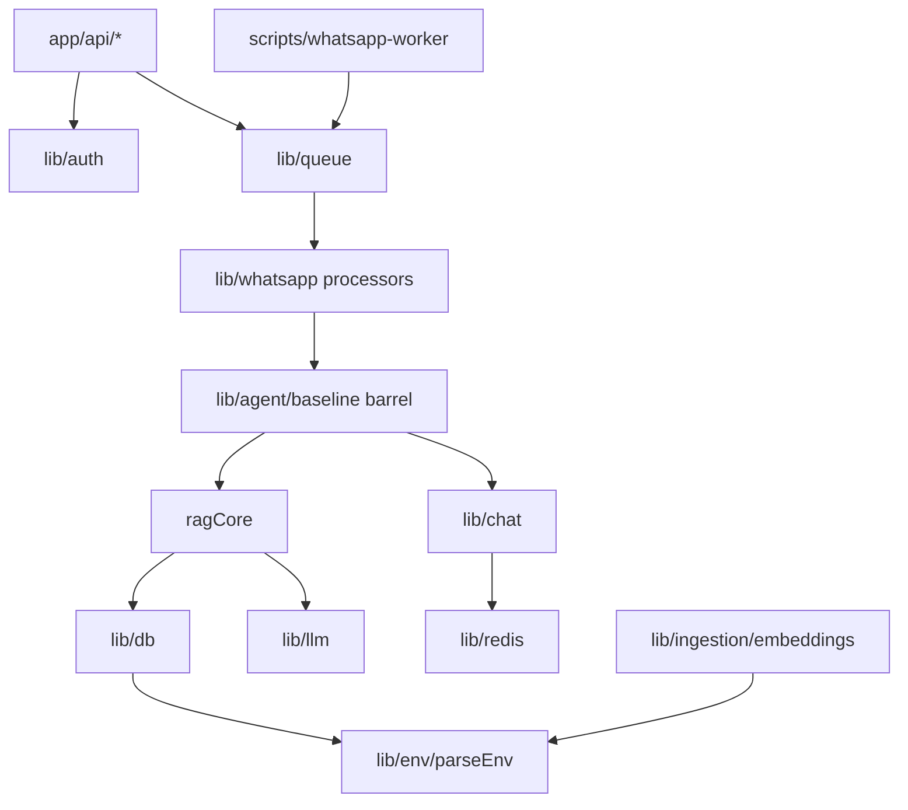

# ScholarAgent Phase 1: Dead Code and Consolidation Audit

This is the **Phase 1 deliverable only**. No files will be changed until you confirm Phase 2.

**Governing decision:** keep the current domain layout (`lib/whatsapp`, `lib/agent`, `lib/chat`, `lib/ingestion`, `lib/auth`, `lib/queue`, `lib/db`). A directory reshuffle would rewrite every import path and is the fastest way to break contracts. Cleanup stays in-place.

## What must not move

These are live contracts. Phase 2–4 will not rename, reshape, or relocate them:

- Routes: [app/api/whatsapp/webhook/route.ts](app/api/whatsapp/webhook/route.ts), [app/api/upload/route.ts](app/api/upload/route.ts), [app/api/webhooks/document-deleted/route.ts](app/api/webhooks/document-deleted/route.ts)
- Queue names in [lib/whatsapp/types.ts](lib/whatsapp/types.ts): `whatsapp-incoming`, `document-ingestion`
- Job payload types `ParsedInboundEvent` / `ParsedInboundDocumentEvent`
- HMAC webhook verification, `DISTRESS_PATTERNS`, `evaluateInboundSafety`, RLS transaction helpers, hybrid retrieval SQL
- Mock LLM provider ([lib/llm/providers/mock.ts](lib/llm/providers/mock.ts)) — default when `LLM_PROVIDER` is unset
- Empty [instrumentation.ts](instrumentation.ts) — documents why Next.js must stay producer-only
- All six Jest suites (parse/signature/ingestion/safety/jobRuntime/queue id)

Two Redis clients stay separate on purpose: [lib/redis/client.ts](lib/redis/client.ts) (`maxRetriesPerRequest: 3`) vs [lib/queue/connection.ts](lib/queue/connection.ts) (`maxRetriesPerRequest: null` for BullMQ). Merging them would stall webhook ACKs.

---

## A. Dead code (confirmed)

### A1. No unused runtime source files

Every `.ts` module under `lib/`, `app/`, and `scripts/` has at least one live importer, or is a Next/Jest/script entry. There is **no orphan processor, provider, or helper file** to delete.

Keep (often mistaken for dead):

- [lib/llm/providers/mock.ts](lib/llm/providers/mock.ts) — runtime fallback
- [scripts/ingest_directory.ts](scripts/ingest_directory.ts) — live CLI; missing from `package.json` scripts
- Safety pattern arrays in [lib/agent/baseline/safetySignals.ts](lib/agent/baseline/safetySignals.ts) — used internally; do not delete. They can be **unexported**.
- [lib/observability/tracing.ts](lib/observability/tracing.ts) — optional Langfuse path

### A2. Dead exports (safe to remove or unexport)

| Symbol | File | Evidence |
|---|---|---|
| `CHAT_HISTORY_RLS_SCHEMA_SQL` | [lib/auth/rls.ts](lib/auth/rls.ts) | Never imported. Live policies are in migrations (`005`, `009`). This string is a drift hazard. |
| `uniqueViolationConstraint` | [lib/db/client.ts](lib/db/client.ts) | Exported, never called (`isUniqueViolation` is used) |
| `upsertDocumentsBatch` (+ `EmbeddingRecord` if it becomes unused) | [lib/db/pgvector.ts](lib/db/pgvector.ts) | No call sites. Live write path is `insertDocumentWithChunks` |
| `evaluateGoldenDataset`, `meetsTargets`, `scoreReport` | [lib/metrics/ragas.ts](lib/metrics/ragas.ts) | Eval runner calls `evaluateRagas` directly |
| `STANDARD_RECORDS`, `ADVERSARIAL_RECORDS`, `getRecordsByRole` | [scripts/data/golden_dataset.ts](scripts/data/golden_dataset.ts) | Runner uses `GOLDEN_DATASET` only |
| `fetchWithTimeout` (raw `Response` helper) | [lib/http/fetchWithTimeout.ts](lib/http/fetchWithTimeout.ts) | Callers use `fetchTextWithTimeout` / `fetchBinaryWithTimeout` |

Safe to **unexport** (keep implementation):

- `canAccessChunk` — only used by `filterAuthorizedChunks` (eval + upload still need the filter)
- `getPool` / `getServicePool` — only used inside [lib/db/client.ts](lib/db/client.ts)
- `buildWhatsAppMessagesEndpoint`, `DEFAULT_RETRIEVAL_OVERFETCH` — internal
- `resolveWhatsAppMediaUrl`, `WHATSAPP_MEDIA_MAX_BYTES` — only used inside media download
- `estimateTokens`, `truncateText`, `MAX_CONTEXT_CHARS`, `MAX_CONTEXT_TOKENS`, `MAX_INBOUND_MESSAGE_CHARS` — only used inside [lib/chat/context.ts](lib/chat/context.ts)
- `fetchTodayStaffChatHistories`, `formatStaffRowsForLlm` — only used inside admin history
- `sendL0HistoryMenu`, `handleL0ButtonReply`, `handleL0SpecificUserName`, `L0_SPECIFIC_USER_PROMPT` — only used by `resolveL0AdminFlow`
- Safety regex exports except those the test file imports (`classifySafetySignals`, `containsMandatoryHandoffSignals`, `PRIVACY_BLOCK_RESPONSE_HE`)

### A3. Duplicate / unused config files (safe delete)

- **Delete** [docker/docker-compose.yml](docker/docker-compose.yml) — Postgres-only leftover. Canonical stack is root [docker-compose.yml](docker-compose.yml) (Postgres + Redis + app + worker).
- **Delete** [eslint.config.mjs](eslint.config.mjs) — ESLint 8 (`package.json`) uses [.eslintrc.json](.eslintrc.json). The flat config is unused.

Keep [docker/init.sql](docker/init.sql), [docker/Dockerfile](docker/Dockerfile), [docker/Dockerfile.worker](docker/Dockerfile.worker).

### A4. Unused npm package

- Remove `@testing-library/jest-dom` — listed in `devDependencies`, never imported; Jest env is `node` and there is no React/DOM test.

Do **not** remove: `jose`, `langfuse`, `mammoth`, `pdf-parse`, `chalk`, `dotenv`. `tsx` is unused by npm scripts (headers mention `npx tsx`); keep it unless you want to drop the documented manual invocation path.

**Add** `tsconfig-paths` as a direct dependency. `worker:whatsapp` / `evaluate` / `reconcile` register it, but it is only transitive today via `ts-node`.

### A5. Handoff defects (not dead code, but must be in the cleanup)

- [.env.example](.env.example) currently embeds a real-looking `DATABASE_URL` / `DATABASE_SERVICE_URL`. Replace with placeholders before organizational handoff. Do not touch `.env.local`.
- Runtime env vars **used in code but absent** from `.env.example`: `WHATSAPP_WEBHOOK_RECEIPT_TIMEOUT_MS`, `WHATSAPP_INCOMING_JOB_ATTEMPTS`, `LLM_FAST_MODEL`, `GEMINI_FAST_MODEL`, `EVAL_CONCURRENCY`, `EVAL_INTER_QUERY_DELAY_MS`, `SHOW_EVAL_ANSWERS`, `PG_SERVICE_POOL_MIN`, `CHAT_REPORT_TIMEZONE`. (`WHATSAPP_GRAPH_API_VERSION` is a documented alias of `WHATSAPP_API_VERSION`.)
- `package.json` vs README: README still says `npm run db:migrate`, `npm run worker`, `npm run ingest`, `npm run eval`. Actual scripts are `migrate`, `worker:whatsapp`, `evaluate`, `reconcile`. `ingest_directory.ts` has **no** npm script.
- [lib/observability/tracing.ts](lib/observability/tracing.ts) uses `type LangfuseClient = any`. Replace with a minimal structural type (`unknown` + narrowing). Do not change tracing behavior.

**Do not change** `next.config.mjs` `eslint.ignoreDuringBuilds: true` during this cleanup — turning it on can fail CI without a separate lint-fix pass.

---

## B. Redundant / fragmented modules

### Merge or extract (behavior-preserving)

1. **Baseline barrel is lying.** [lib/agent/baseline/index.ts](lib/agent/baseline/index.ts) is the RAG core (`runBaselineRagCore`), not a barrel. [orchestrator.ts](lib/agent/baseline/orchestrator.ts) already imports from it.
   - Move RAG core to `lib/agent/baseline/ragCore.ts`
   - Make `index.ts` a real barrel that re-exports `ragCore`, `orchestrator`, and safety entry points
   - Update the handful of direct imports (`incomingMessageProcessor`, `evaluate_runner`, orchestrator)
   - **No** change to `processBaselineQuery` control flow

2. **Env parsing is in the wrong layer.** `parsePositiveInt` / `parseNonNegativeInt` live in [lib/queue/jobRuntime.ts](lib/queue/jobRuntime.ts) but are imported by `lib/db/client.ts`, `lib/ingestion/embeddings.ts`, and the webhook route. Move them to `lib/env/parseEnv.ts` and re-export from `jobRuntime.ts` so existing test imports keep working.

3. **Admin Redis sessions share boilerplate.** [lib/chat/l0AdminSession.ts](lib/chat/l0AdminSession.ts) and [lib/chat/adminAnalyticsSession.ts](lib/chat/adminAnalyticsSession.ts) duplicate key/TTL get-set-del. Extract a tiny helper (e.g. `lib/redis/jsonSession.ts`) but **keep the two public APIs and distinct prefixes/TTLs** (`admin:l0session:` 1h JSON vs `admin:analytics:` 5min flag). Merging the files would mix two different session machines.

4. **WhatsApp Graph outbound is split on purpose.** [sendMessage.ts](lib/whatsapp/sendMessage.ts) (config, retries, text send) vs [messaging.ts](lib/whatsapp/messaging.ts) (read receipts, typing keepalive, interactive buttons) vs [formatting.ts](lib/whatsapp/formatting.ts) (11-line markdown normalizer used by agent + send path).
   - **Do not merge send vs typing** — typing is non-throwing UX on the critical path; send is retrying and throwing.
   - Optional low-risk fold: move `formatWhatsAppMarkdown` into `sendMessage.ts` and re-export. Skip unless you want fewer micro-files; the duplication cost is one function.

### Do not merge (looks fragmented, contracts differ)

- **LLM providers** (`openai` / `gemini` / `claude` / `mock`) — shared fetch helper already exists. Combining adapters would hide provider-specific role mapping (Gemini alternation, Anthropic `system`, OpenAI chat completions).
- **WhatsApp ingest vs HTTP upload.** [documentIngestionProcessor.ts](lib/whatsapp/documentIngestionProcessor.ts) repeats redact → chunk → embed → `insertDocumentWithChunks`, but with **slice size, pause, and max-chunk caps** that [uploader.ts](lib/ingestion/uploader.ts) does not use. Unifying the embed loop would change quota behavior on one of the two paths. Leave both; optionally extract only shared metadata via existing [chunkMetadata.ts](lib/ingestion/chunkMetadata.ts).
- **Chat modules** (`history.ts`, `adminHistory.ts`, `context.ts`) — different RLS: sender-scoped vs admin `withRlsTransaction`.
- **Auth split** (`roles`, `rls`, `rbac`, `timingSafe`, `extractUser`, `userRegistry`) — small files, distinct call sites (webhook HMAC vs JWT upload vs retrieval).
- **Agent handlers** (`intentRouter`, `chatHistoryHandlers`, `adminAnalyticsHandler`, `safetySignals`, `orchestrator`) — this is the state machine. Collapsing it would make the safety/admin flows harder to review.

### Copy-paste that we will **not** “fix” (behavior risk)

`formatWhatsAppMarkdown` runs in RAG answer assembly **and** again in `sendWhatsAppTextMessage`. Changing that could alter delivered WhatsApp text. Observe only.

### Rejected merge recommendations (from the duplication audit)

Keep these split on purpose:

- `sendMessage.ts` + `messaging.ts` — throwing Graph send vs non-throwing typing UX
- Two queue modules / two worker factories — different concurrency, timeouts, and job-id prefixes (`wa_` vs `doc_`); a shared handler helper is optional later, not Phase 3
- WhatsApp ingest vs HTTP `ingestDocument` — different embed pacing and max-chunk caps
- Dual distress checks (processor + orchestrator) — defense in depth, independently tested

Optional later (not Phase 3): one shared Hebrew `UNAUTHORIZED_MESSAGE` constant so the two processors cannot drift.

---

## C. Architectural cleanup (Phase 3, after pruning)

Stay inside current domains. Proposed in-place shape:

- `lib/agent/baseline/index.ts` becomes a real barrel
- `lib/env/parseEnv.ts` for env ints
- `lib/redis/jsonSession.ts` for session get/set/del
- No new barrels under `lib/whatsapp`, `lib/auth`, or `lib/chat` — they would create cycles (`orchestrator` → chat → whatsapp → agent)

Import graph after Phase 3 (no new cycles):

---

## D. Proposed execution (wait for your go-ahead)

**Phase 2 — prune only**
- Remove dead exports listed in A2 (delete unused functions/strings; unexport internals)
- Delete `docker/docker-compose.yml` and `eslint.config.mjs`
- Remove `@testing-library/jest-dom`; add `tsconfig-paths`
- Sanitize `.env.example`; add missing env keys with comments/defaults
- Add `"ingest": "node --require ts-node/register --require tsconfig-paths/register scripts/ingest_directory.ts"`
- Replace Langfuse `any` with a structural type
- Do not touch orchestrator, safety, queues, SQL, or route handlers except unused-import cleanup

**Phase 3 — consolidate**
- `index.ts` → `ragCore.ts` + barrel
- Extract `parseEnv.ts` with re-exports from `jobRuntime.ts`
- Extract Redis session helper; keep public session APIs
- Optional: shared `UNAUTHORIZED_MESSAGE` constant for the two WhatsApp processors
- Skip WhatsApp ingest/uploader unification, send+messaging merge, and LLM-provider merges

**Phase 4 — verify**
- `npx tsc --noEmit`
- `npm test`
- Grep to confirm deleted symbols have zero importers
- Confirm `.env.example` keys cover every `process.env` read
- Confirm queue names, webhook HMAC, and `DISTRESS_PATTERNS` are byte-identical

---

## Out of scope (explicit)

- No LangGraph rewrite (orchestration is already a deterministic state machine)
- No migration / RLS / pgvector SQL edits
- No API path or job payload changes
- No enabling `eslint.ignoreDuringBuilds: false`
- No README rewrite beyond optional script-name alignment if you want it in Phase 2
